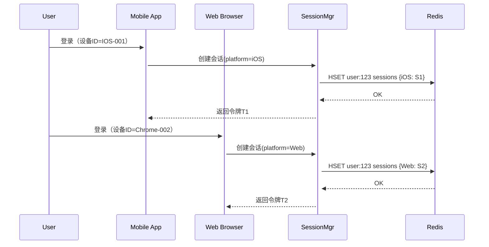
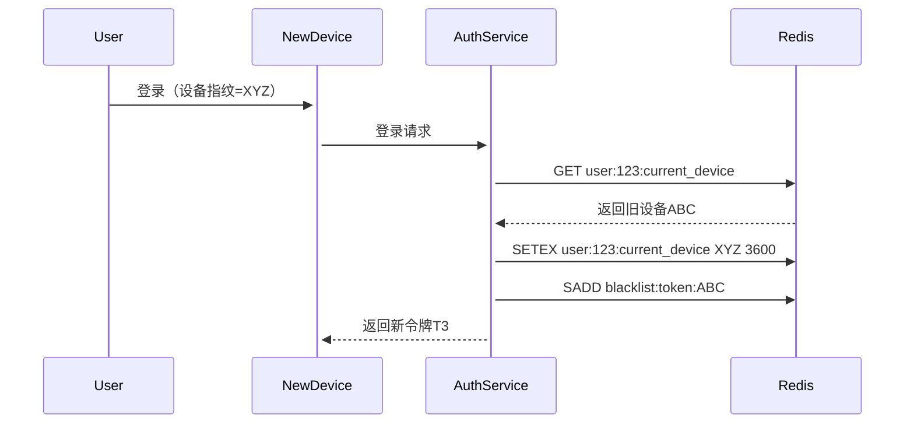
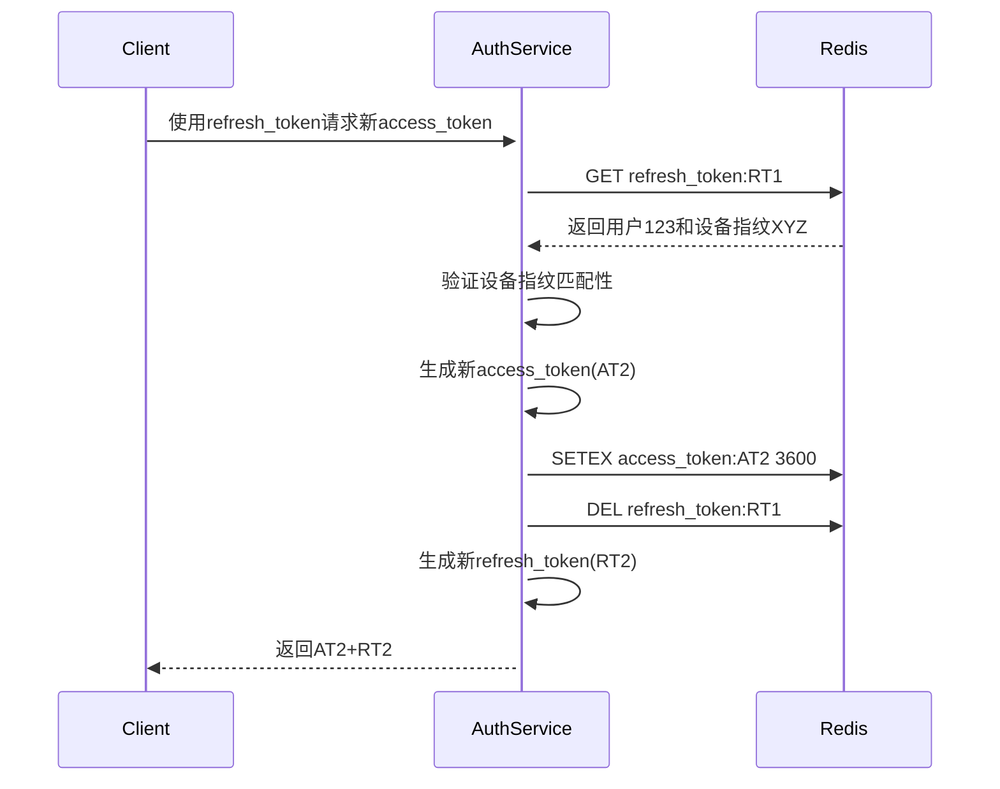
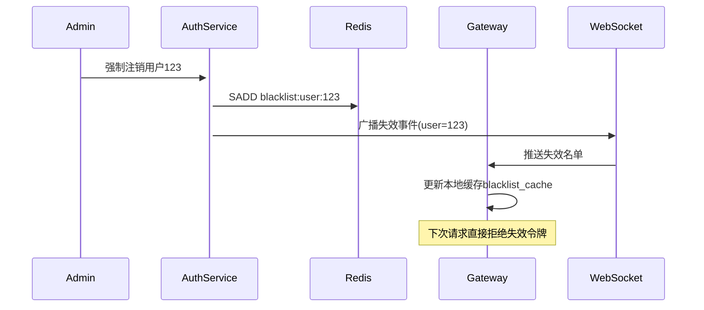
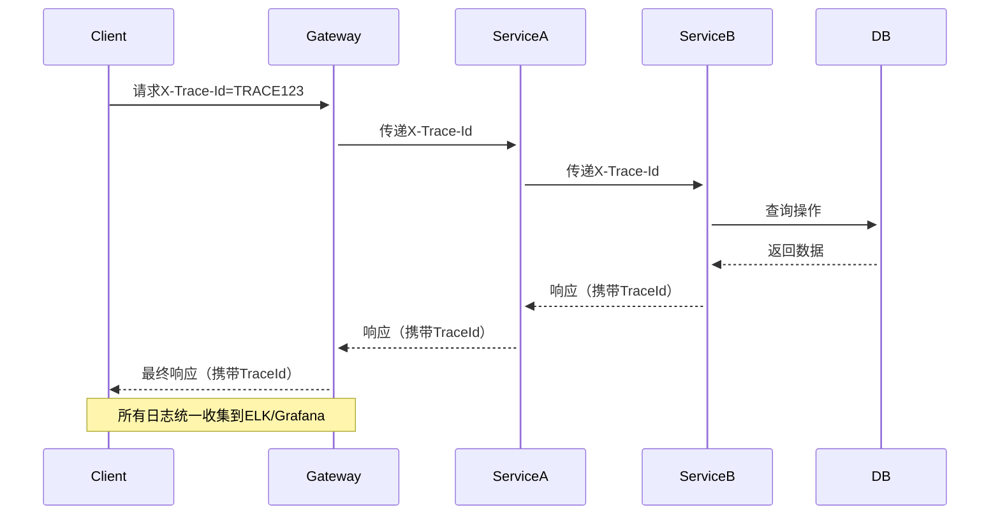

# go-mall

本项目是一个基于 Go 语言和 Gin 框架的实战项目，涵盖了从基础环境搭建到高级功能实现的完整开发流程。项目通过模块化设计和分层架构，展示了如何构建一个健壮、可维护的 Web 应用程序。项目还提供了 Docker-Compose 和 Kubernetes 的部署方案，方便开发者快速搭建开发环境和生产环境。

这个项目只做后端部分

## 项目结构
项目分为多个部分，涵盖了从基础配置到业务模块实现的完整流程：

### 第一部分：基础环境与项目初始化

> Go 基础环境搭建和 Gin 项目初始化

- 定制化项目配置：使用 Viper 管理项目配置，支持热加载

- 项目日志管理：集成 Zap 日志库并配置日志自动切割，然后封装日志自动为日志添加traceID和程序位置

- 全局中间件：实现请求日志记录、跨域处理、错误恢复等，保证项目健壮性和可观测性

- 错误处理：自定义错误类型，错误链条串联和发生位置记录，确保错误处理的一致性和可维护性

- 接口规范化：规范接口响应格式，统一错误码和错误响应，分页响应的标准化，方便前端调用

### 第二部分：项目架构与模块化设计

- 项目的软件分层设计和约定：定义好项目的分层架构和模块划分

- 路由的分模块管理：模块化管理

- GORM与日志整合：慢查询和数据库错误监控

- Redis 的封装和统一管理

- 业务模块划分与解耦

- 用 Option 模式和对接层规范化外部 API 的对接

阶段性总结：为了让项目好 Debug 我们做了这些事情
> 用Docker-Compose、K8s 两种方式快速给项目搭建一套开发环境-- MySQL 和 Redis

### 第三部分：用户认证体系

- 业务需求分析与模块划分：根据需求划分业务模块，确保功能清晰、职责单一

- 多平台用户认证体系：实现支持多平台登录、同平台登录互踢、Token 泄漏检测的认证系统

- Token管理：Token 的派发、存储和认证管理、刷新机制方式过期、防偷窃踢人下线

- 用户密码安全：使用加密书算法存储用户密码，用户注册、登录、登出功能的实现

- 自定义Error增强：扩展自定义 Error，支持错误解包和 errors.Is 判定

### 第四部分：用户与商品管理

- 用户个人信息管理：实现密码的安全修改和重置，对用户信息脱敏处理

- 商品模块：实现商品分类管理，支持分类的增删改查，提供商品列表分页查询、商品搜索和商品详情功能

- 购物车模块：添加、修改购物车、购物项列表和结算信息功能实现，使用 职责链模式 解耦商品满减和优惠逻辑，提升代码可扩展性

- 订单模块：

   创建订单、订单查询和取消的功能实现

  对接微信支付接口，演示支付流程。

  使用 **模板 + 策略模式** 实现多场景支付，支持灵活扩展。


### 第五部分：测试与部署

- 项目的单元测试：测试的基础搭建和数据库的 Mock 测试，对接口、方法、Package 的 Mock 测试

- 容器化与k8s部署：将应用打包为 Docker 镜像，支持快速部署和管理，在 Kubernetes 上部署应用实现平滑重启和安全调度


总结：怎么把项目扩展成微服务


使用到的组件和框架
Gin：轻量级 Web 框架

Viper：配置管理

Zap：高性能日志库

GORM：ORM 框架

go-redis：Redis 客户端

lo：Go 语言实用工具库

## 架构设计

> 项目架构采用**松散型分层架构**

### 用户接口层:

用户接口层只用于处理用户界面显示和用户的请求响应，针对后端API服务，基本上该层就是负责接受用户请求、验证请求、调用下层拿到结果返回响应，在这里不应该包含核心业务逻辑。

### 应用层

应用层里面是应用服务，主要负责用例流的任务协调，每个用例流对应一个服务方法(可以理解为API接口)
，应用服务是领域服务的直接调用者，它主要协调对领域服务的操作，同时像发送基于某个事件的消息通知、发邮件、短信给用户等操作都会写在应用层，这样能让领域服务能专注于核心的业务逻辑。
应用服务还有一个作用是，当一个API的逻辑需要多个领域服务一起协作来完成时，一个清晰地解决方案是通过应用服务来对多个领域服务来进行协调调用。

### 领域层

领域层是真正写业务逻辑的地方，这个业务逻辑可以理解成本领域的核心业务逻辑，比如怎么通过CRUD完成某件事写在这里，而成功或者失败后向什么地方推送消息通知、调用其他领域服务、请求其他API这些核心之外的业务逻辑则写在应用层的应用服务里，领域层只关注本领域里的业务逻辑，应用层负责协调调度它们。

### 基础层

基础层放置我们为项目提供的一些公共、通用的能力:数据的访问和持久化、对接第三方平台能力而封装的库、为项目开发的基础组件等都放在这一层。

上述是这4个概念，是一种概念性的，实际项目结构如下：

```shell
├── api              # 接口层
│   ├── controller   # 控制器
│   ├── router       # 路由
│   ├── request      # 请求对象（DTO）
│   └── reply     # 响应对象（VO）
├── pkg              # 公共库（可被外部引用）
│   ├── errcode      # 错误码
│   ├── logger       # 日志
│   ├── middleware   # 中间件
│   └── pagination   # 分页处理（原common/app）
├── internal         # 内部逻辑（禁止外部引用）
│   ├── logic        # 业务逻辑层
│   │   ├── service  # 应用服务
│   │   └── domain   # 领域服务/对象
│   ├── dal          # 数据访问层
│   │   ├── entity    # 数据模型
│   │   ├── dao      # 数据操作
│   │   └── cache    # 缓存
│   └── event        # 领域事件（原dal/event）
├── configs          # 配置文件（原resources）
└── test             # 测试用例（根目录下）
```

```mermaid
```

## 项目的基础搭建

### 1.集成并初始化viper

> 效果：可以读取yaml的数据到结构体，并支持热加载

安装并使用viper，将yaml的配置信息，读取并解析到结构体中去，另外调用viper的监听方法，yaml配置有变动就更新结构体的数据信息，使其支持热加载

### 2.初始化gin框架和zap日志组件

>
效果：完善项目的健壮性和观测性，使用zap封装一个好用的日志组件。每次请求都可追踪到，并有请求和响应数据，方便后期排查问题，以及panic恢复中间件可以让日志记录具体的错误信息，还有在业务逻辑发生错误也会调用到这个日志组件，并记录错误信息以及错误发生的位置（包括文件以及行号出错）

这部分会定义一些基础中间件，比如路由请求会追加上traceID、spanId、parentSpanId来跟踪请求调用链还有请求前后加上日志信息。

错误处理大致是底层（dao、基础设施）抛出错误、中层（领域服务、应用服务）包装错误、上层（控制层）记录错误

### 3. 集成gorm框架

> 效果：使用gorm来操作mysql，并将慢查询或者其他错误信息使用自己封装好的日志来记录下来

### 4.集成Redis

### 5.对项目分层设计

### 6. 封装external层对接外部的API

### 7. 项目的认证系统设计

### 8. 用户模块

> 效果：用户的注册、登录、登出 与 认证系统整合

### 9. 商品模块以及商品分类

> 效果：商品的列表分页查询、商品搜索、商品详情，另外还有使用责任链模式实现商品各种满减和优惠逻辑解耦

### 10. 购物车模块

> 效果：添加修改购物车、购物车列表、结算功能

### 11. 订单模块

> 效果：创建、查询、取消订单，订单支付与微信支付对接，以及应对多种渠道支付

### 12. 构建适用CI的够项目容器化方案

### 13. 部署到K8S上运行

### 14.测试

```mermaid
sequenceDiagram
	actor 用户
	participant 客户端
	participant 认证服务器
	participant 资源服务器

    用户->>客户端: 输入用户名/密码
    客户端->>认证服务器: 发送凭证
    认证服务器->>认证服务器: 验证凭证，生成JWT
    认证服务器-->>客户端: 返回访问令牌和刷新令牌
    客户端->>资源服务器: 携带访问令牌请求资源
    资源服务器->>资源服务器: 验证JWT
    资源服务器-->>客户端: 返回资源
    
```

## 认证系统

#### 多平台独立会话管理（通过会话隔离）



#### 设备互斥登录（基于设备指纹）



#### 安全令牌刷新机制（双令牌+时间窗口）



#### 令牌失效及时性控制（实时广播+本地缓存）



#### 全链路追踪




d:\Environments\GoWorks\src\github.com\Cospk\go-mall\
├── api                  # API定义
│   ├── proto            # Protobuf定义
│   └── swagger          # Swagger文档
├── cmd                  # 入口程序
│   ├── api-gateway      # API网关服务
│   ├── user-service     # 用户服务
│   ├── product-service  # 商品服务
│   └── order-service    # 订单服务
├── pkg                  # 公共包
│   ├── auth             # 认证相关
│   ├── config           # 配置相关
│   ├── database         # 数据库相关
│   ├── errors           # 错误处理
│   ├── logger           # 日志相关
│   └── middleware       # 中间件
├── internal             # 内部包
│   ├── user             # 用户服务
│   ├── product          # 商品服务
│   ├── order            # 订单服务
│   └── payment          # 支付服务
├── scripts              # 脚本文件
├── configs              # 配置文件
├── deployments          # 部署文件
│   ├── docker           # Docker相关
│   └── kubernetes       # Kubernetes相关
└── docs                 # 文档